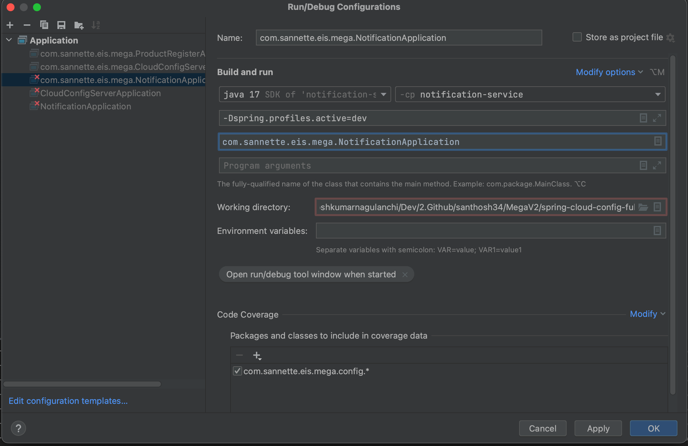

# Spring Cloud Config with Git, Vault and Couchbase 

## Objective

 Creates a Spring Cloud Config Server with three Backends 1) Git 2) Vault 3) Couchbase 
 Creates 2 Services 1) Product Register Service 2) Notification Service
 
 We store required application configurations of Proudct Register And Notification Services in Spring Cloud Config Server. 
 We store secured configuration of Product Register and Notifiation Services in Vault
 
 When these two applications are spinning up, application configurations of respective services will be pulled from 
 3 backends git, vault and couchbase and override the properties as per their order of preferences. 
 order 1 wins and order N will be ignored for the same attribute if exists in multiple backends.

## Repo Usage Guide

### 1. Start all the containers using docker compose
```shell
$ cd KafkaDockerCompose
$ pwd
    KafkaDockerCompose
$ docker-compose up -d
```
Above command will start the following containers
- Kafka
- Zookeeper
- Vault
- Couchbase 

### 2. Kafka Container validation & Create a topic in Kafka

    $ nc -z localhost 22181
    Connection to localhost port 22181 [tcp/*] succeeded!

    $ nc -z localhost 29092
    Connection to localhost port 29092 [tcp/*] succeeded!

    $ docker-compose logs kafka | grep -i started
    kafka_1      | [2021-04-10 22:57:40,413] DEBUG [ReplicaStateMachine controllerId=1] Started replica state machine 
    with initial state -> HashMap() (kafka.controller.ZkReplicaStateMachine)
    kafka_1      | [2021-04-10 22:57:40,418] DEBUG [PartitionStateMachine controllerId=1] Started partition state 
    machine with initial state -> HashMap() (kafka.controller.ZkPartitionStateMachine)
    kafka_1      | [2021-04-10 22:57:40,447] INFO [SocketServer brokerId=1] Started data-plane acceptor and 
    processor(s) for endpoint : ListenerName(PLAINTEXT) (kafka.network.SocketServer)
    kafka_1      | [2021-04-10 22:57:40,448] INFO [SocketServer brokerId=1] Started socket server acceptors and 
    processors (kafka.network.SocketServer)
    kafka_1      | [2021-04-10 22:57:40,458] INFO [KafkaServer id=1] started (kafka.server.KafkaServer)
Create a new topic. This topic will be used as pub-sub for configuration changes from config server to application 
microservices.
```
    $ docker exec kafka kafka-topics --bootstrap-server kafka:9092 --create --topic myownmanuallycreatedtopic
```
Please note that 'kafka' in the above line is container name that we mentioned in docker-compose.yml 
Few More useful commands: 
```
    $ docker exec kafka kafka-topics --bootstrap-server kafka:29092 --list
    $ docker exec kafka kafka-topics --bootstrap-server kafka:29092 --delete --topic myownmanuallycreatedtopic
```
Kafka properties in CloudConfigServer are default for localhost. 

### 3. Create Application Configuration in Git ( 1st backend ) 

#### Pre-Req: 
We are using git ssh authentication(No Manual Password) to connect to Github from my local mac m1. 
Please follow the github ssh configuration steps.
https://docs.github.com/en/authentication/connecting-to-github-with-ssh

#### Keep the Application configuration in git
Followed 2 Strategies to keep the Configuration files for Notification Service and Product Register Services

- Strategy1
  - {application}/{env}
- Strategy2
  - {application}-{env}

Please refer the following GitHub repo for the configurations for Notification Service & Product Register service
https://github.com/santhosh34/spring-cloud-config-store
Also we used this same repo in CloudConfigServer application properties as git backend. 

### 4. Create Application Configuration in Vault ( 2nd backend )

Create Configuration as shown below. Please note that we created a new secret engine with name 'secret' instead of kv and 
no file naming strategy except the application name. 


Once vault Server is up and running login to http://localhost:8200/ui/ and proceed with vault key and token setup. 

Update newly Vault Token in Spring CloudConfigServer Application Properties


### 5. Create Application Configuration in Couchbase ( 3rd backend )

#### Pre-Req:
   Decide where to keep the configuration in couchbase? Default collection or  collection with specific scope ??
   Ref: https://docs.couchbase.com/server/current/tutorials/buckets-scopes-and-collections.html

   Decide to use the root user or  least privileged user. 

#### How I organized my configuration in couchbase:
  
   Bucket: configuration-store
   Scope:  application-properties
   Collection: technical
     This minimized the number of buckets, scopes and collections for many applications.

   Login to Couchbase on: http://localhost:8091/ui/index.html as administrator 
      1) Create Bucket & Scope & Collection
      2) Create User who can access this collection.  
        ref: 

   we used the same configuration in CloudConfigServer application properties to connect to couchbase. 

   Create Configuration of Notification Service in Couchbase as a Document
      Ref: 
            a) 
            b) 

### 6. Start the Servers

- Start the CloudConfigServer
- Start the NotificationService
  - Make sure run the service in dev profile as shown in below
      
- Start the ProductRegisterService
- Validation below
    - Config Server On:               http://localhost:8888
    - Product Register On:            http://localhost:8081
    - Notification Server On:         http://localhost:8082

- Config Server Validation
  - http://localhost:8888/notification-service/stg
  
- Notification Service Validation
  - http://localhost:8082/notification-service/properties/host

- Product Register Service Validation
    - http://localhost:8081/product-register/properties/host  

- Debug if in case
```shell
-Dspring.profiles.active=dev -Dspring-boot.run.jvmArguments="-Xdebug -Xrunjdwp:transport=dt_socket,server=y,suspend=y,address=5005"
```
### 7. Helpful Postman collection with series of Api Calls to Validate: 


### Development Debug Notes:

Learning how to connect to Kafka Broker running inside docker

Create a new topic in container: 
    docker exec kafka kafka-topics --bootstrap-server kafka:9092 --create --topic myownmanuallycreatedtopic

    Here  1st and 3rd 'kafka' words are container name mentioned in docker-compose file.
    2nd kafka word is kafka command. 

How to list all our topics:

    docker exec kafka kafka-topics --bootstrap-server kafka:29092 --list

How to delete a specific topics:

    docker exec kafka kafka-topics --delete --zookeeper zookeeper:2181 --topic myownmanuallycreatedtopic
    docker exec kafka kafka-topics --delete --bootstrap-server kafka:29092 --topic myownmanuallycreatedtopic
   

How to Stop All Dockers:

    $pwd
        KafkaDockerCompose
    $docker-compose down 

Vault: 
----------------------------
docker exec vault vault status                            
Key             Value
---             -----
Seal Type       shamir
Initialized     true
Sealed          false
Total Shares    1
Threshold       1
Version         1.13.2
Build Date      2023-04-25T13:02:50Z
Storage Type    file
Cluster Name    vault-cluster-28200ac2
Cluster ID      d60c79f6-c509-c569-197d-abc8ea841fc0
HA Enabled      false

docker exec -it vault  vault  login   
Token (will be hidden): <<Give the Token>>

docker exec vault  vault kv put secret/myapp key1=value1
docker exec vault  vault kv put secret/myapp key1=value1 -token="hvs.CPNeSjNXR1VOKWNvpRv7i6iV"
docker exec vault  vault kv get producer-application
docker exec vault  vault kv get secret/producer-application

-----Diff flow
docker-compose up -d 
docker ps
docker-compose exec vaultcontainer sh
$vault operator init
    Error initializing: Error making API request.
    URL: PUT http://127.0.0.1:8200/v1/sys/init
    Code: 400. Errors:
    * Vault is already initialized
$vault operator unseal 102aceeb9ccc7a3e2d446b1249e28fa21d1c2777283720b7dde76556cc68c143

    Key             Value
    ---             -----
    Seal Type       shamir
    Initialized     true
    Sealed          false
    Total Shares    1
    Threshold       1
    Version         1.13.2
    Build Date      2023-04-25T13:02:50Z
    Storage Type    file
    Cluster Name    vault-cluster-28200ac2
    Cluster ID      d60c79f6-c509-c569-197d-abc8ea841fc0
    HA Enabled      false

$ vault login hvs.CPNeSjNXR1VOKWNvpRv7i6iV

    Success! You are now authenticated. The token information displayed below
    is already stored in the token helper. You do NOT need to run "vault login"
    again. Future Vault requests will automatically use this token.

    Key                  Value
    ---                  -----
    token                hvs.CPNeSjNXR1VOKWNvpRv7i6iV
    token_accessor       FEwGhBklUtJqxD5iAOak7q70
    token_duration       ∞
    token_renewable      false
    token_policies       ["root"]
    identity_policies    []
    policies             ["root"]

$ vault kv get kv/producer-application

    ======== Secret Path ========
    kv/data/producer-application

    ======= Metadata =======
    Key                Value
    ---                -----
    created_time       2023-05-08T01:09:12.111771802Z
    custom_metadata    <nil>
    deletion_time      n/a
    destroyed          false
    version            1

    ==== Data ====
    Key     Value
    ---     -----
    key1    secretvalue1
    key2    secretvalue2

$ 

Lets say if you are accessing from HOST

curl -vik -H "X-Vault-Token: hvs.CPNeSjNXR1VOKWNvpRv7i6iV" http://localhost:8200/v1/cubbyhole/mytestkey

Dt: 12th May 

New root Key: hvs.W6RaHqLrLPwyTGu3I5A9oxKF

Key1:
gDbhUYOGPoPYEtMiT7ypuDK/8OLlYmnbPWfvfV4286o=

hvs.W6RaHqLrLPwyTGu3I5A9oxKF

